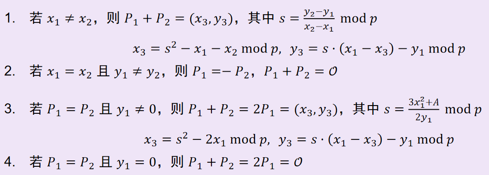
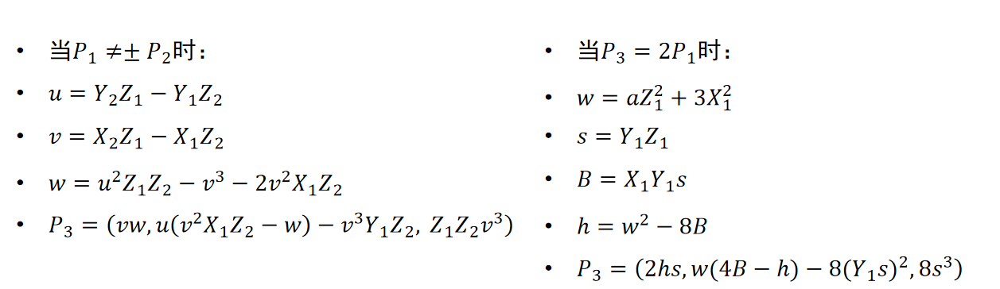
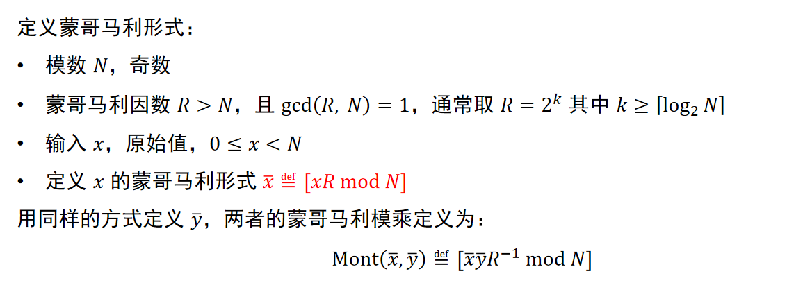
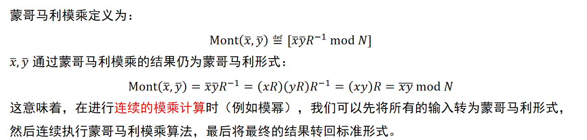

### 文档声明

#### 合规性提示
本文档仅用于IPsec VPN技术原理及应用场景的知识科普，不涉及任何翻墙工具的推荐、使用指导或技术破解内容。根据中国法律法规，未经许可私自使用VPN访问境外网络属于违法行为，相关使用需严格遵守国家网络安全管理规定及企业合规要求。

#### 版权与使用说明
本文档所有内容（包括技术原理、分类说明、应用场景等）均为作者原创整理，仅供个人学习、研究参考使用，禁止用于任何商业用途（如付费课程、商业出版物、盈利性内容分发等），禁止以任何形式（包括完整转载、节选、截图、二次编辑后转发等）在其他平台传播。任何获取、使用本文档的用户，均需完整保留作者信息及本声明内容，不得抹去或修改原创标识。

#### 内容免责
本文档内容仅为技术知识梳理，不构成专业指导建议。因引用本文档内容导致的任何直接或间接后果（包括但不限于信息误差、合规风险、第三方投诉等），作者不承担法律责任。文档中提及的技术方案（如IPsec VPN协议、实现流程）仅作原理说明，具体使用需结合当地法律法规及企业内部规范。

# IPsec VPN

## 1 简介
IPsec VPN 是基于 IPsec 协议实现的虚拟专用网络技术，通过对 IP 层会话数据进行加密与认证等操作，确保数据在网络传输过程中的机密性、完整性与时效性。需要注意的是，IPsec 不能隐藏通信双方的 IP 地址，而是能防止出现 IP 地址冒充的情况。

## 2 四个核心阶段

### 2.1 流量触发
该技术不会对所有流量进行加密，而是通过 “Interesting Traffic（感兴趣流）” 来定义需要加密的流量，只有符合条件的流量才会触发后续加密流程。  
定义 “Interesting Traffic” 需借助 ACL（Access Control List，访问控制列表）技术：当 VPN 网关识别到符合 ACL 加密规则的流量时，便会触发 IPsec 流程。

### 2.2 密钥协商
有密码学基础的朋友会了解，在通信环境中交换密钥并非易事 ―― 公网环境复杂，可能面临通信窃听、通信对象伪装、通信内容篡改、通信内容重放及中间人攻击等多种安全难题。  
IPsec 协议通过 IKE（Internet Key Exchange，互联网密钥交换）协议实现通信双方的安全可靠密钥协商，具体分为两个阶段：

#### （1）建立 IKE SA（安全通信信道）
此阶段的目的是为密钥协商过程本身提供加密保护。
1. 双方首先通过报文向对方告知自身支持的安全策略，包括IPsec协商时的加密算法、IKE协商时的认证算法、DH 密钥交换参数及 SA 生存周期等，最终确定一套双方共同支持的策略。
2. 协商完成后，进行身份认证，以防范中间人攻击。身份认证一般通过预共享密钥或数字证书完成，一旦认证失败，会话会立即终止。
3. 随后双方进行 DH 密钥交换，用于生成会话公钥、各自专属的私钥以及数据流加密所需的主密钥（Master Key）。【通常，数据流加密采用对称密钥，即通信双方使用同一密钥对数据加密，而前面提到的公钥算法则用于安全传输该对称密钥。此外，通过主密钥进行密钥派生可生成临时会话密钥，避免因密钥丢失而需重新建立共享密钥（仅通过派生密钥和派生算法无法逆向推导出主密钥）。】
4. 利用主密钥进行密钥派生，为阶段 2 的通信数据加密做准备。

当双方通过密钥实现数据流加密并完成身份认证，即成功建立安全可靠的通信后，便进入第二阶段。  
上述过程可通过主模式或积极模式完成：主模式通过六个报文完成所有步骤，积极模式则仅需三个报文。二者的区别在于身份信息是否以明文形式传输。

#### （2）建立 IPsec SA（数据加密）
基于阶段 1 建立的安全通信信道，协商用于保护用户数据的 IPsec SA，明确具体的加密与认证规则。
1. 双方交换 IPsec 策略，选择共同支持的方案，包括数据封装模式、数据加密算法、数据认证算法及 AH/ESP 协议等。
2. 双方基于阶段 1 获得的主密钥，生成 IPsec 会话密钥与认证密钥。

至此，双方可通过这两个密钥进行对称加密通信，并对数据的完整性及对方身份进行认证。

### 2.3 数据传输
数据传输环节通常采用 ESP 协议实现。具体流程为：首先使用加密密钥对原始的IP数据包进行加密，然后插入 ESP 头（包含协议标识、序列号等信息）和 ESP 尾（包含填充字段等信息），形成 “ESP 头 + 密文 + ESP 尾” 的 ESP 数据段；接着对 ESP 数据段进行哈希值计算，生成认证数据；最后将新的 IP 头（包含双方 VPN 网关的源地址和目的地址）、ESP 数据段及认证数据拼接后发送。  
接收方的处理过程则为上述流程的逆操作。

## 3 相关细节

### 3.1 ACL技术
ACL（Access Control List，访问控制列表）是由一系列规则组成的集合，用于精准识别特定的报文流。这些规则以判断语句的形式定义了报文的匹配条件，常见的匹配条件包括报文的源地址、目的地址、端口号等。

#### 3.1.1 ACL须知
设备通过 ACL 规则识别出符合条件的特定报文后，会依据预先设定的策略进行处理。其中，最典型的应用是利用 ACL 实现报文过滤。此外，ACL 还可在路由、安全、QoS 等业务场景中用于识别报文，而对这些报文的具体处理方式，则由应用 ACL 的相应业务模块来决定。  
用户创建 ACL 时，必须为其指定编号或名称。其中，不同编号对应不同类型的 ACL（见表 1）；ACL 创建后，用户可通过编号或名称对其进行应用与编辑。  
需注意：对于编号相同的基本 ACL 或高级 ACL，需通过`ipv6`关键字加以区分；对于名称相同的 ACL，则需通过`ipv6`和`mac`关键字进行区分。

| ACL类型 | 编号范围 | 适用版本 | 规则制订依据 |
|---------|----------|----------|--------------|
| 基本ACL | 2000-2999 | IPv4、IPv6 | 源IP地址 |
| 高级ACL | 3000-3999 | IPv4、IPv6 | 源IP地址、目的IP地址、报文优先级、IP承载的协议类型以及特性等三四层信息 |
| 二层ACL | 4000-4999 | IPv4、IPv6 | 源MAC地址、目的MAC地址、链路层协议类型等二层信息、802.1p优先级 |

#### 3.1.2 ACL详情
当 ACL 包含多条规则时，报文会按特定顺序匹配规则，一旦匹配成功则终止匹配。匹配顺序分为以下两种：
- 配置顺序：按规则编号从小到大依次匹配。
- 自动排序：按 “深度优先” 原则由深到浅匹配，不同类型 ACL 的排序规则如表 2 所示。

| ACL 类型 | “深度优先” 排序法则 |
|----------|---------------------|
| IPv4 基本 ACL | 1. 含 VPN 实例的规则优先； 2. VPN 实例情况相同时，源 IPv4 地址范围小的优先（“0” 位多的通配符掩码对应范围更小）； 3. 地址范围相同时，先配置的规则优先。 |
| IPv4 高级 ACL | 1. 含 VPN 实例的规则优先； 2. VPN 实例情况相同时，指定 IPv4 承载协议类型的规则优先； 3. 协议范围相同时，源 IPv4 地址范围小的优先； 4. 源地址范围相同时，目的 IPv4 地址范围小的优先； 5. 目的地址范围相同时，TCP/UDP 端口覆盖范围小的优先； 6. 端口范围无法比较时，先配置的规则优先。 |
| IPv6 基本 ACL | 1. 含 VPN 实例的规则优先； 2. VPN 实例情况相同时，源 IPv6 地址前缀长的优先（范围更小）； 3. 前缀长度相同时，先配置的规则优先。 |
| IPv6 高级 ACL | 1. 含 VPN 实例的规则优先； 2. VPN 实例情况相同时，指定 IPv6 承载协议类型的规则优先； 3. 协议范围相同时，源 IPv6 地址前缀长的优先； 4. 源前缀长度相同时，目的 IPv6 地址前缀长的优先； 5. 目的前缀长度相同时，TCP/UDP 端口覆盖范围小的优先； 6. 端口范围无法比较时，先配置的规则优先。 |
| 二层 ACL | 1. 源 MAC 地址范围小的优先（“1” 位多的 MAC 掩码对应范围更小）； 2. 源 MAC 范围相同时，目的 MAC 地址范围小的优先； 3. 目的 MAC 范围相同时，先配置的规则优先。 |

**说明**：
- IPv4 地址范围通过通配符掩码的 “0” 位数量判断：“0” 位越多，范围越小（通配符掩码中 “0” 表示必须匹配，“1” 表示不关心，与子网掩码相反）。
- IPv6 地址范围通过前缀长度判断：前缀越长，范围越小。
- MAC 地址范围通过 MAC 掩码的 “1” 位数量判断：“1” 位越多，范围越小。

#### 3.1.3 ACL 补充
ACL 的每条规则需有唯一编号，创建时可手动指定，未指定则由系统自动分配。为便于后续在现有规则间插入新规则，系统自动分配编号时会在相邻编号间预留空间，相邻编号的差值即为步长（如步长为 5 时，编号依次为 0、5、10……）。  
系统自动分配规则：从起始值开始，分配大于现有最大编号的最小步长倍数。例如：现有编号为 0、5、9、10、12，步长为 5 时，新规则编号为 15。  
步长修改影响：修改步长后，所有规则编号会从起始值按新步长重新排列（如步长 5 时编号 0、5、9、10、15，改为步长 2 后变为 0、2、4、6、8）。  
特殊说明：若匹配顺序为自动排序，修改步长后，新编号按 “深度优先” 顺序重新分配，而非原编号顺序。  

传统报文过滤只对分片报文的首个分片进行匹配过滤，对后续分片一律放行，因此网络攻击者通常会构造后续分片进行流量攻击。为提高网络安全性，ACL规则缺省会匹配所有非分片报文和分片报文的全部分片，但这样又带来效率低下的问题。为了兼顾网络安全和匹配效率，可将过滤规则配置为仅对后续分片有效。  

ACL参考链接：[01-ACL配置-新华三集团-H3C](https://www.h3c.com/cn/d_202205/1609309_30005_0.htm#_Toc103004188)

### 3.2 DH（Diffie-Hellman）密钥交换
DH（Diffie-Hellman）密钥交换是一种在不安全网络中，让通信双方无需预先共享密钥，就能安全协商出对称密钥的密码学技术。其核心思想是利用数学难题（离散对数问题）的不可逆性，使双方通过交换公开信息，各自计算出相同的共享密钥，而第三方即使截获公开信息也无法推导出密钥。

#### 3.2.1 基于g^x = y mod p形式的DH
DH算法的核心基础是“有限域上的离散对数问题”。对于给定的g和p，如果知道x，那么可以在很短的时间内通过经过优化的乘法计算出y。但是知道y，无法高效求出x（前提是选取的p满足p-1的最大素因子依旧很大）。  

双方交换密钥的具体步骤如下：
1. A选择p和g，通知B（使用校验和防止中间人篡改），B收到并回复同意。
2. A选择一个a，计算ha = g^a mod p，把ha发送给B。
3. B选择一个b，计算hb = g^b mod p，把hb发送给A。
4. 双方协商出共享密钥k = g^ab mod p。（已知g^a和g^b难求出a或b进而求出g^ab）（k仅128 bit就能让现代超级计算机束手无策）

**补充**：
1. g一般选取mod p的生成元【生成元是指当x遍历[1,p]时，g^x mod p的值互不相同】。
2. p一般选取大素数，4096 bit以上。
3. 快速乘法算法有 Karatsuba 算法O(n^1.585)、Toom-Cook 算法O(n^1.465)、FFT（快速傅里叶变换）乘法O(n log n)，其中FFT最高效。
4. 离散对数算法：
   - 4.1 当p-1的最大素因子较小（10的6次方级）时，采用Pohlig-Hellman算法，可在毫秒级完成，时间复杂度是关于p-1的最大素因子呈亚线性。
   - 4.2 当p-1的最大素因子较大（10的7次方级及以上），但是p规模中等（10的40次方级）时，采用Pollard’s Rho算法，时间复杂度是关于p-1的最大素因子呈亚线性。
   - 4.3 当p是超级大素数（超过10的100次方级）且最大素因子很大，采用指数演算法，时间复杂度是关于p呈亚指数。
   - 4.4 当p很小时（10的6次方级以内），采用婴儿步巨人步算法，时间复杂度是关于p呈亚线性，但是这个算法的空间复杂度是关于p呈亚线性的，开销太大【前三个办法都是迭代型，空间开销几乎为常数】。
5. 为了保证k的安全强度达到128 bit，要求p选择4096 bit以上的安全素数【其实可以让p = 2q + 1，q是大素数】推荐一个p = 2^384 ? 2^128 ? 2^96 + 2^32 ? 1，g = 2。

#### 3.2.2 基于椭圆曲线的DH
一般常见的椭圆曲线的形式为y? = x? + ax + b mod p，为了群的交换性，要求4a? + 27b? ≠ 0。W(x3, y3) = P(x1, y1) + Q(x2, y2)的计算方法如下：  

（其中，O表示无穷远点。）

DH算法的核心基础是“有限域上的离散对数问题”。对于给定的G和p，如果知道x，那么可以在很短的时间内通过经过优化的乘法计算出y。但是知道y，无法高效求出x（前提是选取的p满足p-1的最大素因子依旧很大）。  

双方交换密钥的具体步骤如下：
1. A选择椭圆曲线、p和G（G是该群的一个生成元，为点(x, y)形式），通知B（使用校验和防止中间人篡改），B收到并回复同意。
2. A选择一个a，计算ha = aG mod p，把ha发送给B。
3. B选择一个b，计算hb = bG mod p，把hb发送给A。
4. 双方协商出共享密钥k = abG mod p。（已知xP和yP难求出x或y进而求出xyP）（注意，k通过点W = abG按照一定规则获取的）

**补充**：
1. 其他的椭圆曲线群有蒙哥马利形式、扭曲现形式、Weierstrass形式等。
2. 有一种叫做投影坐标系的计算方法能够避免模逆运算（在模运算中，除一个数等于乘一个数的逆(a * a?? = 1 mod p，一般使用扩展欧几里得算法计算一个数的模逆)），取而代之的是模乘和模加运算。
3. 蒙哥马利算法能够大幅度减少模乘运算的时间开销（模乘运算的最大开销在于试除法）。

##### 3.2.2.1 投影坐标系计算
关于计算P3 = P1 + P2：

##### 3.2.2.2 蒙哥马利算法

### 3.3 身份认证

#### 3.3.1 预共享密钥
通信双方预先共享一个对称主密钥（可以通过人工在芯片隔离区进行预装等方法实现），经过密钥派生算法计算会话密钥k。
1. A生成随机数a，使用k对“a + A设备身份信息”进行加密，发送给B。
2. B生成随机数b，解密密文后使用k对“b + B设备身份信息 + a”进行加密，发送给A。
3. A使用k加密“a + A设备身份信息 + b”，发送给B。  
类似三次握手。

#### 3.3.2 公钥体制
公钥体制，又称非对称加密体制，是一种通过一对数学相关的密钥（公钥和私钥）实现加密通信的密码系统。公钥可公开传播，用于加密信息或验证签名；私钥则由用户秘密保存，用于解密用公钥加密的信息或生成签名。其核心逻辑基于“单向函数”和“陷门信息”：用公钥加密容易，但实现高效解密是不可能的，而私钥作为陷门能高效完成解密。这种体制无需提前共享密钥，解决了传统对称加密的密钥分发难题，是现代网络安全的基础，广泛应用于HTTPS通信、数字签名、身份认证等场景，典型算法包括 RSA、椭圆曲线密码（ECC）等。  
公钥体制的具体应用如下：  
选定两个大素数p和q，计算N = p * q，有Φ(N) = (p - 1)(q - 1)。选定公钥e（不宜太小）满足gcd(e, Φ(N)) = 1，那么私钥为d，则满足d = e?? mod Φ(N)。  
用于加密时，c = m^e mod N，接收方计算c^d mod N即为m。这里m是发送者想要秘密传输给接收方的消息。  
用于签名时，s = m^d mod N，任何人都可凭借公钥e计算s^e mod N即为m。这里m是签名者想要宣告自己担保的内容。

#### 3.3.3 数字证书
CA是一个具有公信力的认证机构，大家都相信它的公钥是正确的并且它会对申请者的资料做详细调查，确保其合法性，它用自己专有的私钥对各个申请数字证书的设备进行签名：  
使用私钥对“设备信息+设备公钥”进行签名，获得一个签名数据。  
对于通信双方，想要验证双方的身份是简单的，只需使用CA提供的公钥对数字签名进行运算并比较对方提供的设备信息和设备公钥即可完成身份验证。

### 3.4 IPsec数据的机密性与完整性
传统的加密与校验是分开的，不仅需要按照顺序计算，还需要两把密钥，一把用于加密（Encrypt），另一把用于校验（MAC），一般采用E than M的形式（先对明文加密，再对密文进行校验计算）。这样保证了任何企图篡改内容的数据包都无效，同时利用随机数和伪随机扩展将传输的数据包进行了随机化【攻击者无法通过伪造成通信的另一方对以往消息进行猜测并验证】。  

AES-GCM将加密和校验进行一体化设计，相比传统的独立加密与校验，AES-GCM能够防止出现粗心的错误（比如先校验再加密，这样将不再是CPA安全的。有关安全性，可参考[穗 禾-CSDN博客主页](https://blog.csdn.net/2301_80444339?type=blog)的文章）、避免加密与校验的随机参数出现碰撞或两个特定参数导致保密性脆弱、防止重放攻击、防止填充预言攻击（填充预言攻击是一种专门针对分组密码填充字段的攻击，能够将看似安全的加密在可接受时间内进行破解）、支持高效并行计算、优化数据传输效率等。  

有关AES-GCM，可参考[穗 禾-CSDN博客主页](https://blog.csdn.net/2301_80444339?type=blog)的文章。

本文章归属 github 用户 WhatTheFuck-cyber